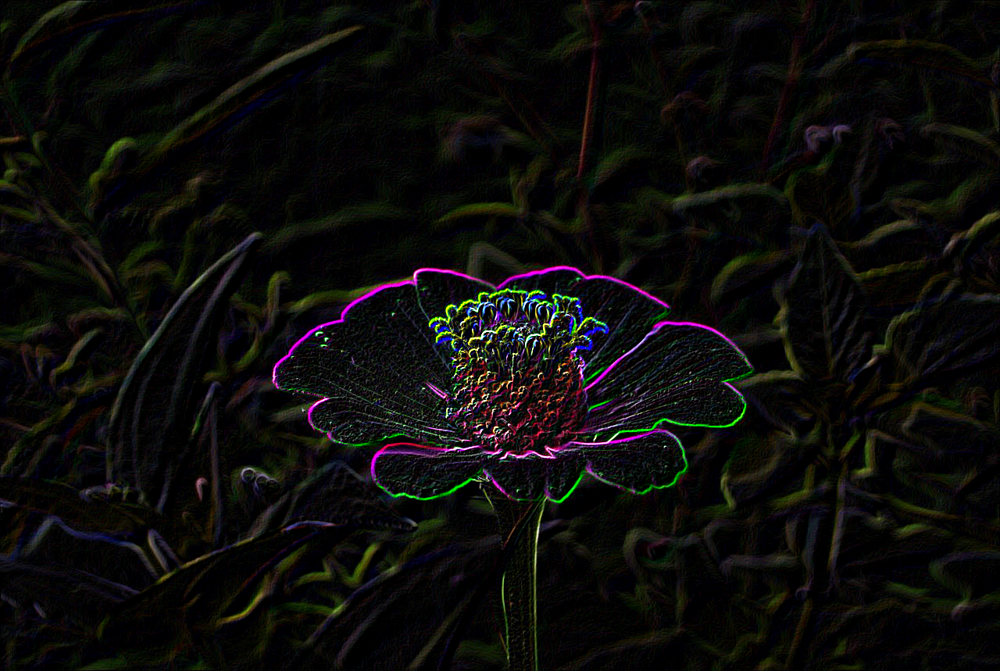

### Proyecto Convolution
La convolución es una forma matemática de combinar dos señales para formar una tercera. Es la técnica más importante en el procesamiento de señales digitales. 
En este caso se aplicó este concepto para realizar un programa donde se detecta los bordes de una imagen e igualmente de un video en tiempo real, utilizando principalmente la libreria Open CV en Python.

La segunda parte de este proyecto consiste en la recreación de un track de cámara para crear un filtro como los usados en la red social Instagram. Para ello se utilizó como base el código compartido por Sergio Canu en la plataforma py source.

##### Pre-Requisitos:
*Se necesita instalar previamente los paquetes de Open CV y Argsparse para el correcto funcionamiento del programa.* 
+ Entornos de escritorio estándar (Windows, macOS, casi cualquier distribución GNU / Linux)
	+ Open Cv: `pip install opencv-python` 
	+ Argsparse: `pip install argsparse`
	+ DLib: `pip install dlib`
		+ 64-bits Python runtime
		+ CMake
+ Archivos de datos de reconocimiento facial (Colocar en la raiz del repositorio)
	+ [Link](https://drive.google.com/file/d/17aeCg7M6E_tma23lD1kdVeWmp-kjC9hu/view?usp=sharing)


##### Construido con:
- Python 3.8.5 x64
- Open CV
- NumPy
- Argsparse
- DLib

##### Ejemplos de ejecución:
</img>

*Ejemplo Imagen Original*


</img>

*Ejemplo de Imagen con Convolución*


</img>

*Previsualización de la interfaz de vídeo*

##### Ejecución
Comando:
```python Convolution.py [-i camera_index] [-f file_path] [-h]```

Para una descripción de los argumentos se puede usar `python Convolution.py -h`

El argumento `-i` recibe un número entero, el cual le indicará al programa de qué dirección de hardware tomará la señal de vídeo, por defecto es 0

El argumento `-f` recibe una ruta de archivo, el cual será convolucionado con sobel y guardado.

Sin parámetros el programa abrirá la cámara 0 del ordenador y ejecutará la interfaz de usuario.

##### Licencia:
Este proyecto es de código abierto y está bajo la [MIT License](https://choosealicense.com/licenses/mit/).
